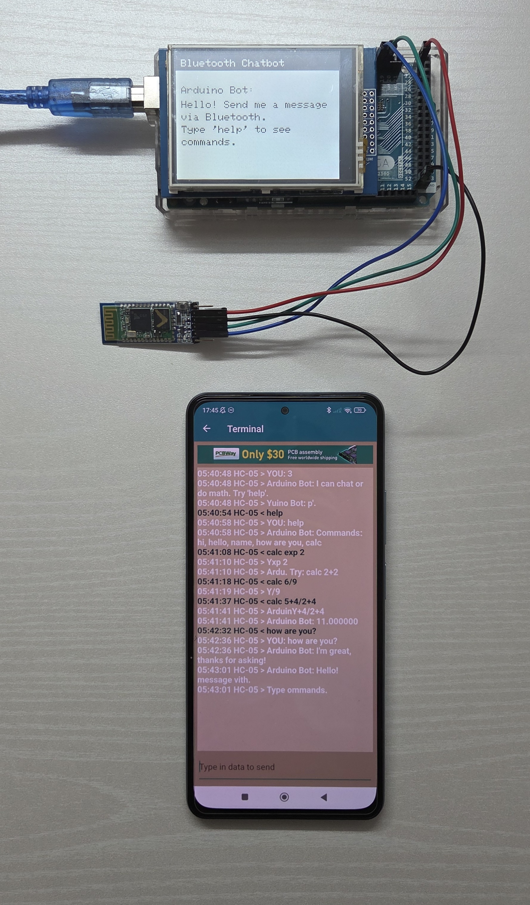

# Arduino Mega 2560 Bluetooth Chatbot

A clean, minimal **Bluetooth Chatbot** UI for **Arduino Mega 2560** ,
chats with simple intent replies, and includes a built-in **calculator** (`calc <expr>`).

> **Android app required:** install **Arduino Bluetooth Control** and use the **Terminal** feature  
> https://play.google.com/store/apps/details?id=com.broxcode.arduinobluetoothfree

---

##  Features

- **TFT UI (MCUFRIEND 2.8")**
  - White background, black text
  - Black header with *“Bluetooth Chatbot”*
  - Centered welcome screen (no boxes / no flicker)
- **Chat intents**
  - `hi`, `hello`, `how are you`, `name`, `help`
- **Calculator**
  - `calc <expr>` with `+ - * / ^ ( )` and constants `pi`, `e`
  - Example: `calc (2+3)*4^2`
- **Robust input handling**
  - Newline or idle-timeout finalization
  - Case-insensitive, whitespace trimmed
- **Boards**
  - Mega2560 → `Serial1` on **D18 (TX1) , D19 (RX1)**

---

## Components Used

| Part | Pins | Notes |
|---|---|---|
| **MCUFRIEND 2.8" TFT** | 8-bit parallel (UNO shield pinout) | Uses `MCUFRIEND_kbv` |
| **HC-05/HC-06 Bluetooth** | **Mega 2560:** Serial1 (TX1=18, RX1=19) | 9600 baud |

---

## Libraries

Install via Arduino Library Manager:

- **MCUFRIEND_kbv**
- **Adafruit_GFX**

*(No extra math/parser libs needed — included in sketch.)*

---

## Setup

1. Wire the **HC-05** to your board:
   - **Mega:** HC-05 TX → **RX1 (19)**, HC-05 RX → **TX1 (18)**
2. Upload the sketch.
3. Pair your phone with the HC-05 (PIN often `1234`/`0000`).
4. Open **Arduino Bluetooth Control** → **Terminal**.
5. Send messages/newline-terminated text to chat.

---

## Commands

- `hi`, `hello` → friendly greeting  
- `how are you` → simple status  
- `name` → bot name  
- `help` → show command list  
- `calc <expr>` → evaluate math  
  - Examples:
    - `calc 2+2`
    - `calc (2+3)*4`
    - `calc 2^8`
    - `calc pi*2`
    - `calc (5-1)/(2+2)`

---

## Circuit Diagram

| Description | Image |
|--------------|--------|
| **System Diagram** | ![Chatbot Diagram]](ChatBot_NoticeBoard_Circuit_Diagram.png) |
| **Actual Build** | |

---

## Implementation Notes

- **UI rendering:** header + two message panes (`YOU:` / `Arduino Bot:`) with word-wrapping.  
- **Parser:** lightweight recursive-descent for `+ - * / ^` with precedence, parentheses, `pi`, `e`.  
- **Input buffering:** completes on newline **or** after `MSG_IDLE_TIMEOUT` (400 ms) of inactivity.  
- **Serial selection:** `Serial1` on Mega; `SoftwareSerial` on D10/D11 for Uno/Nano.
